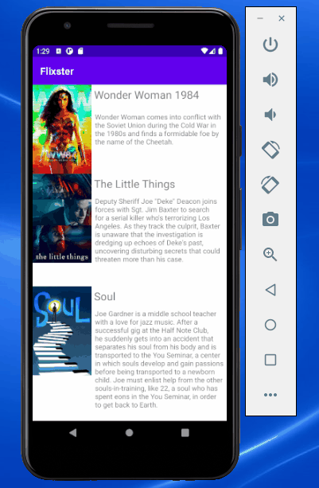

## Flixster

### User Stories

#### REQUIRED

- [x] User can view a list of movies (title, poster image, and overview) currently playing in theaters from the Movie Database API.
- [x] Expose details of movie (ratings using RatingBar, popularity, and synopsis) in a separate activity.
- [x] Views should be responsive for both landscape/portrait mode.
- [x] In portrait mode, the poster image, title, and movie overview is shown.
- [x] In landscape mode, the rotated alternate layout should use the backdrop image instead and show the title and movie overview to the right of it.
- [x] Allow video posts to be played in full-screen using the YouTubePlayerView.

### App Walkthough GIF

`TODO://``Flixster.gif`. 

 

### Notes

I encounted a problem because I was using Android emulator of API 30.

## Open-source libraries used
- [Android Async HTTP](https://github.com/codepath/CPAsyncHttpClient) - Simple asynchronous HTTP requests with JSON parsing
- [Glide](https://github.com/bumptech/glide) - Image loading and caching library for Android# Flix

Flix is an app that allows users to browse movies from the [The Movie Database API](http://docs.themoviedb.apiary.io/#).

   I created different screens for the app
   I  build the User Interface / layout for each screen
   I showed a list of similar items (each item has a movie image, title, and description)
   I retrieve all the information needed to display all of this data.

#### BONUS
-[] Add rounded corners for the images using the Glide transformations (1 point)
-[]Improve the user interface through styling and coloring (1 to 5 points depending on the difficulty of UI improvements)
-[]Apply the View Binding library to reduce view boilerplate (2 points)
-[]Allow video posts to be played in full-screen using the YouTubePlayerView (3 points)
-[]From the movie details page, show an image preview that allows the user to initiate playing a YouTube video
-[]Check the /movie/{movie_id}/videos endpoint API docs
-[]Endpoint will provide a video "key" such as "key": "SUXWAEX2jlg" which can be used to construct a YouTube video URL such as  https://www.youtube.com/watch?v=SUXWAEX2jlg

### App Walkthough GIF
`TODO:// `Flixster.gif`. 

 

### Notes
I encountered a problem when I was trying to login on Github through AndroidStudio

### Open-source libraries used

- [Android Async HTTP](https://github.com/codepath/CPAsyncHttpClient) - Simple asynchronous HTTP requests with JSON parsing
- [Glide](https://github.com/bumptech/glide) - Image loading and caching library for Androids
